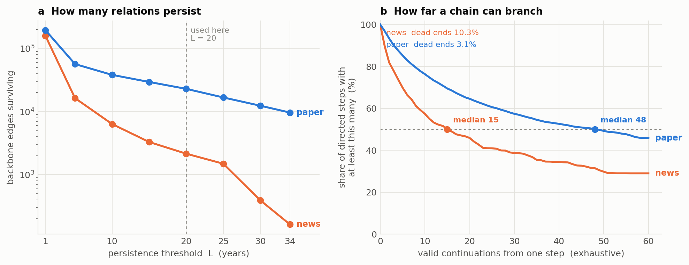
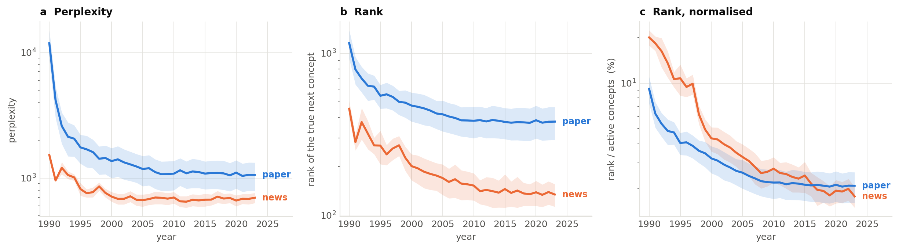
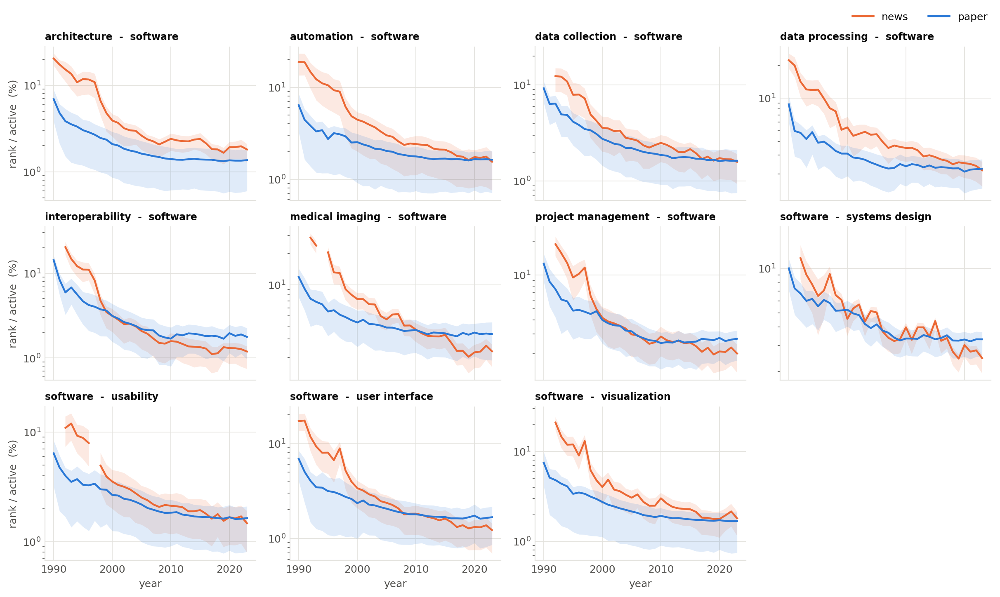

# Persistent path perplexity — 결과보고

2026-08-31 · notebook 05 · 앵커 기반 news / paper 비교

> Notion "@Today Perplexity 결과보고"를 저장소로 옮기면서 두 곳을 고쳤다.
> ① 경로 표본을 지속망 전체 랜덤워크에서 **앵커 고정 확장**으로 바꾼 뒤의 수치로 갱신했다.
> ② "뉴스가 더 낮은 값 → 더 예측 어렵다"는 방향이 반대다. perplexity는 **낮을수록 예측이
> 쉽다**. 게다가 두 코퍼스는 각자 다른 임베딩 모형에 다른 후보 풀을 쓰므로 **수준 비교가
> 성립하지 않는다** — 비교 가능한 것은 기울기뿐이다.

---

## 1. Backbone network 추출

disparity filter (Serrano, Boguñá & Vespignani 2009). 고정 α 대신 **density rule** —
매년 `|E| = 3N` 개를 남기고 최대 신장나무를 합집합한다. 연도·코퍼스마다 밀도가 달라
같은 α가 전혀 다른 밀도의 백본을 만들기 때문이다.

34년 전체에서 나온 서로 다른 백본 엣지: **news 160,112 / paper 196,246**.

각 엣지의 최장 연속 구간 길이별 누적 개수:

| 최장 연속 구간 | news | paper | 비 |
|---|---|---|---|
| ≥ 34년 (전 기간) | 163 | 9,674 | 59.3× |
| ≥ 30년 | 393 | 12,422 | 31.6× |
| ≥ 25년 | 1,495 | 16,799 | 11.2× |
| **≥ 20년 (사용)** | **2,155** | **22,997** | **10.7×** |
| ≥ 15년 | 3,302 | 29,570 | 9.0× |
| ≥ 10년 | 6,361 | 38,297 | 6.0× |
| ≥ 5년 | 16,367 | 56,797 | 3.5× |
| ≥ 1년 | 160,112 | 196,246 | 1.2× |

임계를 올릴수록 격차가 1.2배에서 59.3배로 벌어진다. 뉴스의 지속 엣지 중 34년을 다 버틴
것은 7.6%, 논문은 42.1%다.

---

## 2. Persistent path 추출

`longest_run ≥ L`인 엣지만 남긴 **지속망**을 만들고, 그 위에서 경로를 뽑는다.

사슬 `v₁ – … – v_K`가 지속적이려면 **K−1개 엣지의 지속 구간을 교집합한 길이가 L년 이상**
이어야 한다. 엣지가 각각 오래간 것으로는 부족하고, 사슬 전체가 같은 창 안에서 함께
살아 있어야 한다.

기준은 **L = 20년, K = 6**(주 분석)과 **K = 8**(길이 민감도). 실제로 뽑힌 경로의 유지
기간은 중앙값 21–22년으로 대부분 임계 바로 위에 몰려 있다.



**(a)** 지속 임계 L별 생존 백본 엣지 수.
**(b)** 지속 경로를 한 칸 걸었을 때 조건을 만족하는 다음 칸이 몇 개인가 — 방향 엣지
전수(news 4,310 / paper 45,994)에 대해 센 값이므로 표본이 아니다.

| | 중앙값 분기 | 막다른 길 |
|---|---|---|
| news | 15 | 10.3% |
| paper | 48 | 3.1% |

뉴스 지속망은 `automation` 하나가 863개 노드 중 774개와 연결된 **별 모양**이고 연결선수
중앙값이 1이다. 논문은 4,379개 노드가 중앙값 3으로 고르게 얽혀 있다. 사슬을 이어가기가
뉴스에서 어려운 이유가 이것이다.

> **이전 판에서 고친 것.** (b)는 원래 "랜덤워크가 길이 K의 지속 연쇄를 만들 확률"이었다
> (K=8에서 news 10% 대 paper 30%). 그 숫자는 그래프가 아니라 표본추출기의 성질이었고,
> 희소함을 과장했다 — **길이 K의 지속 경로가 존재하는 노드는 K=20까지도 양쪽 다 99%**다.
> 실제 차이는 경로의 존재가 아니라 분기에 있으므로 분기를 직접 센다.

---

## 3. 뉴스 vs 논문 — 비교 대상 선정

두 코퍼스가 각자 자기 경로를 걸으면 궤적 차이가 **영역 때문인지 경로 때문인지**
구분되지 않는다. 두 지속망의 합집합으로 "공통 그래프"를 만드는 것은 더 나쁘다 — 한쪽에
실제로 없는 엣지를 걷게 된다.

그래서 관계 **하나만** 공유시킨다. **앵커** = 양쪽 코퍼스 모두에서 20년 이상 지속인 엣지.

| 키워드 1 | 키워드 2 | news | paper |
|---|---|---|---|
| architecture | software | 1998–2023 | 1990–2023 |
| automation | software | 1990–2023 | 1990–2023 |
| data collection | software | 1997–2023 | 2001–2023 |
| data processing | software | 1998–2023 | 1990–2023 |
| interoperability | software | 1998–2023 | 1991–2023 |
| medical imaging | software | 1998–2023 | 1997–2019 |
| ~~medical imaging~~ | ~~tomography~~ | ~~2000–2023~~ | ~~1993–2023~~ |
| project management | software | 1996–2023 | 1995–2023 |
| software | systems design | 1998–2017 | 1998–2023 |
| software | usability | 1998–2023 | 1994–2023 |
| software | user interface | 1992–2023 | 1990–2023 |
| software | visualization | 1998–2023 | 1990–2023 |

`medical imaging – tomography`는 제외했다. 뉴스 지속망에서 `tomography`의 연결선수가 1이고
그 유일한 이웃이 앵커의 반대쪽 끝(`medical imaging`)이라, 앵커를 가운데 두는 경로를
**하나도 만들 수 없다**. 논문에서는 500개가 나오지만 짝이 없으므로 양쪽에서 함께 뺐다.
**사용 11개.**

두 지속망이 공유하는 개념은 111개인데 그 사이에서 양쪽 모두 20년 이상 지속되는 관계는
12개뿐이고, **쓸 수 있는 11개가 전부 `software`를 한쪽 끝으로 갖는다**. 이 결과는 두 영역이
공유하는 지속 구조 전체에 대한 것이지, 임의의 주제 영역으로 일반화되지 않는다.

**경로 표본.** 앵커를 한가운데 고정하고(`· · A B · ·`) 양옆으로 `K//2 − 1`칸씩 뻗되, 한 칸
뻗을 때마다 구간 교집합이 20년 이상인 이웃 중에서만 고른다. 앵커·코퍼스·K당 500개.
앵커를 가운데 둔 K=6 지속 경로는 news 776,000–1,453,000개, paper 200만 개 이상이므로
전수 채점은 불가능하다.

**신뢰구간은 2단계.** ① 앵커 안에서 500개 경로를 평균 → 앵커·연도 값 ② 앵커 11개를
표본 단위로 평균·SD·95% CI (t, df = 10). 같은 앵커를 공유하는 경로는 독립이 아니므로
5,500개를 표본으로 세면 CI가 실제보다 좁아진다.

---

## 4. Perplexity 측정

연도 t의 임베딩에게 경로를 한 칸씩 물어본다. 문맥 `c_k = Σ_{i≤k} w_i·z_{v_i,t}`
(`w_i ∝ λ^(k−i)`, λ = 0.5), 점수 `s(u) = c_k·z_{u,t}`, 확률 `p = softmax_u s(u)`.
후보는 그해 활성 개념 전체이고 지나온 노드는 분모에서도 뺀다. 조건이 앞선 개념들로만
이루어지므로 pseudo-perplexity가 아닌 **진짜 perplexity**다. 무방향이므로 정·역 양방향의
기하평균. 임베딩은 기존 LexicalDySAT `[34 × 29,312 × 32]`를 재학습 없이 쓴다.

지표 셋: **PP**, **rank**(정답이 후보 중 몇 등), **rank_norm**(rank ÷ 그해 활성 개념 수).



앵커 11개의 평균과 앵커 수준 95% CI (K = 6). 1990–92는 causal mask 때문에 참조할 과거가
거의 없는 warm-up 구간이라 해석하지 않는다.

| rank_norm (%) | news | paper |
|---|---|---|
| 1990 | 20.11 [17.79, 22.42] | 9.17 [7.33, 11.01] |
| 2000 | 4.31 [3.52, 5.09] | 3.17 [2.53, 3.82] |
| 2010 | 2.71 [2.20, 3.23] | 2.19 [1.71, 2.67] |
| 2016 | 2.27 [1.79, 2.75] | 2.14 [1.67, 2.61] |
| 2023 | 1.78 [1.49, 2.06] | 2.09 [1.61, 2.57] |

**논문은 2010년에 멈춘다** — 2.19% → 2.09%, 13년 동안 0.10%p. 원순위로는 383등 → 378등이다.
**뉴스는 계속 내려간다** — 2.71% → 1.78%. 2016년경 두 곡선이 만나고 이후 역전된다.



앵커마다 한 칸. 선은 그 앵커 500개 경로의 평균, 띠는 경로 간 사분위 범위.

| 2009–2023 기울기 (%/년) | news | paper |
|---|---|---|
| K=6 PP | +0.20 ± 0.27 | −0.33 ± 0.40 |
| K=6 rank | −0.66 ± 0.48 | −0.22 ± 0.33 |
| K=6 rank_norm | −2.88 ± 0.48 | −0.49 ± 0.33 |
| K=8 rank_norm | −3.13 ± 0.42 | −0.51 ± 0.24 |

대응표본 검정 — **news − paper = −2.38 %/년 [−2.82, −1.95], 11/11 앵커에서 부호 동일,
t(10) = −12.2, p < 0.0001** (K=8: −2.62 [−3.05, −2.18]).

---

## 5. 읽을 때 주의할 것

**수준은 비교할 수 없다.** 뉴스와 논문은 각자 다른 임베딩 모형(`news_embeddings.pt`,
`paper_embeddings.pt`)으로 채점되고 후보 풀도 다르다. "2023년 뉴스 134등 < 논문 378등이니
뉴스가 더 굳었다"는 성립하지 않는다. **비교 가능한 것은 기울기뿐이다.**

**PP는 인용하지 않는다.** 임베딩이 양성 1 : 음성 1로 학습되어 softmax가 보정되어 있지 않다.
순위는 서열만 쓰므로 이 문제에 면역이지만 PP는 아니다. PP의 쓸모는 값이 아니라 **불일치
탐지기**다 — PP가 순위와 반대로 움직이면 후보 풀이 빠르게 자라고 있다는 신호다.

**크기와 방향을 분리한다.** 정규화가 필요 없는 원순위에서도 뉴스가 논문보다 후기에 더
움직인다(K=6 p = 0.048, K=8 p = 0.007). **방향**은 정규화 선택에 기대지 않는 결론이다.
다만 −2.38 %/년이라는 **크기**는 후보 풀 증가분(news +25.9%, paper +4.1%)을 포함한다.
원순위(−0.66)와 정규화 순위(−2.88)가 진짜 값을 위아래로 감싼다고 읽는 것이 정확하다.

**대조군이 없다.** 실재하지 않는 사슬을 같은 방식으로 채점해 그 대비 비율로 보고해야
순위 하락이 사슬의 성질인지 허브 효과인지 구별된다. 이것이 갖춰지면 세 지표가 하나로
줄고 코퍼스 간 비교도 열린다. 현재 가장 큰 미완 부분이다.

---

## 6. 경로 예시

앵커·코퍼스별로 2023년 rank_norm이 가장 낮은 경로. 가운데 두 자리는 설계상 항상 앵커이므로
두 코퍼스가 다른 것은 나머지 네 자리뿐이다.

```
automation – software
  news   0.08%   alliances → advisors → [software – automation] → chief executive officers → information systems
  paper  0.29%   image (mathematics) → cluster analysis → [software – automation] → function (biology) → point (geometry)

medical imaging – software
  news   1.11%   marketing → internet → [software – medical imaging] → automation → wireless networks
  paper  0.93%   function (biology) → focus (optics) → [software – medical imaging] → segmentation → pattern recognition (psychology)

software – visualization
  news   0.58%   software industry → executives → [software – visualization] → automation → trademarks
  paper  0.27%   constraint (computer-aided design) → function (biology) → [software – visualization] → work (physics) → image (mathematics)
```

뉴스는 남은 자리를 기업·경영 담론(`alliances`, `chief executive officers`,
`acquisitions & mergers`, `customer services`)으로, 논문은 추상적 방법 어휘
(`image (mathematics)`, `function (biology)`, `point (geometry)`, `cluster analysis`)로
채운다. 관계는 공유하는데 그 관계를 둘러싸는 어휘가 갈린다.

단, 논문 쪽 이웃은 WoS 주제어의 다의어(`point`, `function`, `image`, `class`, `key`)가
지배한다. 어휘 자체의 성질이므로 질적으로 인용할 때 고지해야 한다.

전체 44개 경로는 `results/sequences/anchor_examples.csv`에 있다.
